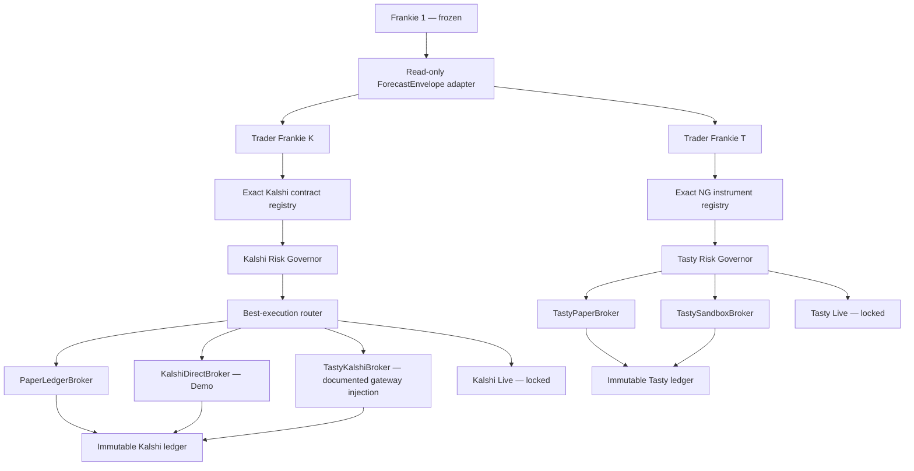

# Trader Frankie dual-venue build report

## Git state

- Repository: `DavisAI1974/Markets`
- Local checkout: `C:\Users\A\Documents\Codex\2026-08-17\we\work\Markets`
- Local branch: `codex/trader-frankie-dual-venue-20260817`
- Source branch: `chatgpt/ng-exhaustion-chain-full-history-phase1-20260817`
- Starting commit: `03d03c3ec5de9274ccb26b15ee51e9355624f316`
- Publication branch: `codex/trader-frankie-dual-venue-20260817`
- Existing tracked files modified: 0
- Scope: new descendant implementation, freeze workflow, and this build report
- Publication: included in the branch commit and pushed to `origin`; no pull request was requested

## Frankie 1 freeze proof

The first added artifact was `research/kalshi/trader_frankie/freeze_manifest.json`.
It pins 166 Frankie runtime, brain/lens, specialist, schema, workflow, deployment, and test files.

- Freeze verification: PASS
- `research/kalshi/spawn.py` SHA-256 before/after:
  `a9bdad63c71f05a2897ffd10d4ca5ac56bfe1030b92db139668254ee68361e6c`
- `research/kalshi/spawn.py` Git blob before/after:
  `2eb3ab8570be66bd9568bcd3ca2e6b9f19d6b33e`
- Freeze manifest starting commit:
  `03d03c3ec5de9274ccb26b15ee51e9355624f316`

`ReadOnlyForecastAdapter` deep-copies the existing JSON output and imports no Frankie 1 runtime
module. State-path enforcement allows writes only in the Kalshi/Tasty descendant evidence,
outcomes, and proposals directories.

## Architecture

## Built

Shared neutral infrastructure:

- immutable `ForecastEnvelope` and external adapter
- runtime risk-issued `ApprovedOrder` capability required by every broker
- explicit fail-closed order lifecycle state machine
- append-only SQLite ledger with update/delete triggers
- separate forecast/trader scorecards and deterministic diagnosis
- review-only learning proposals with no automatic cross-venue or parent learning
- isolated Kalshi and Tasty evidence stores
- composition root that refuses unapproved intents

Trader Frankie K:

- separate identity and structured reasoning prompt
- explicit approved-contract registry and EXACT/MISMATCH/UNKNOWN resolver
- immutable point-in-time Kalshi snapshot capture with raw response hash
- TRADE/STAND_DOWN intent with no execution authority
- full deterministic risk gates and mandatory explicit thresholds
- deterministic direct-vs-tasty route scoring using price, spread, fees, and fill probability
- local paper fills, resting, partial fills, cancellation, positions, settlement, P&L, and restart recovery
- current Kalshi V2 direct Demo submit/cancel/reconciliation adapter
- tastytrade event-contract gateway adapter that fails closed until a supported gateway is supplied
- mechanically locked live broker

Trader Frankie T:

- separate identity and structured reasoning prompt
- exact instrument registry with first-class Future and Future Option types
- NG-first futures path without hard-coding a stale rolling symbol
- immutable live quote snapshot and raw source hash
- TRADE/STAND_DOWN intent with no execution authority
- account eligibility, session, quote, identity, margin, exposure, loss, duplicate, health, and kill-switch gates
- local futures paper fills, resting, partial fills, cancellation, positions, mark/settlement P&L, and restart recovery
- tastytrade Sandbox instrument/balance/position/margin dry-run/order dry-run/submit/cancel/replace/reconciliation adapter
- sandbox and production namespaces/hosts mechanically separated
- mechanically locked live broker

## Validation performed

Per request, no unit, integration, paper smoke, Demo, Sandbox, or authenticated API tests were run.
No credentials were loaded and no external order endpoint was called.

Static validation completed:

- Python compile: PASS
- Import graph: PASS (39 package modules)
- JSON parse: PASS
- Git whitespace/diff check: PASS
- Frankie 1 166-file freeze verification: PASS
- Existing tracked-file modifications: 0

Paper end-to-end smoke status: NOT RUN (deferred as requested).

## Demo/Sandbox readiness

- Kalshi paper: code complete, configuration and smoke validation pending
- Kalshi Demo: adapter complete, signer/transport/credentials/config and offline tests pending
- Tasty paper: code complete, active NG mapping/config/live quote source and smoke validation pending
- tastytrade Sandbox: adapter complete, auth/transport/account/config and offline tests pending
- Tasty event-contract route: interface complete; supported documented gateway implementation pending
- Live execution: mechanically unavailable in both venue families

## Exact remaining steps before the first Kalshi Demo order

1. Review and commit a time-bounded exact Kalshi mapping with settlement source/field/times and route identities.
2. Choose every currently-null paper/risk/router threshold; retain the kill switch during validation.
3. Wire an approved structured-reasoning backend outside Trader Frankie K.
4. Run the offline freeze, adapter, identity, risk, lifecycle, ledger, broker-outage, duplicate, restart, and live-lock tests.
5. Run a real-public-market local paper cycle through fill/position/exit-or-settlement/P&L and inspect stand-downs.
6. Create isolated `KALSHI_DEMO_*` credential references and inject the RSA-PSS signer plus HTTP transport.
7. Reconcile Demo balance, positions, orders, and fills; run order dry rehearsal with the kill switch on.
8. Enable only the reviewed Demo route, submit one risk-approved minimal order, then reconcile fill/cancel/restart state.

## API references used

- Kalshi V2 create order: https://docs.kalshi.com/api-reference/orders/create-order-v2
- Kalshi environments: https://docs.kalshi.com/getting_started/api_environments
- tastytrade Sandbox: https://developer.tastytrade.com/sandbox/
- tastytrade instruments: https://developer.tastytrade.com/open-api-spec/instruments/
- tastytrade orders: https://developer.tastytrade.com/open-api-spec/orders/
- tastytrade margin: https://developer.tastytrade.com/open-api-spec/margin-requirements/
