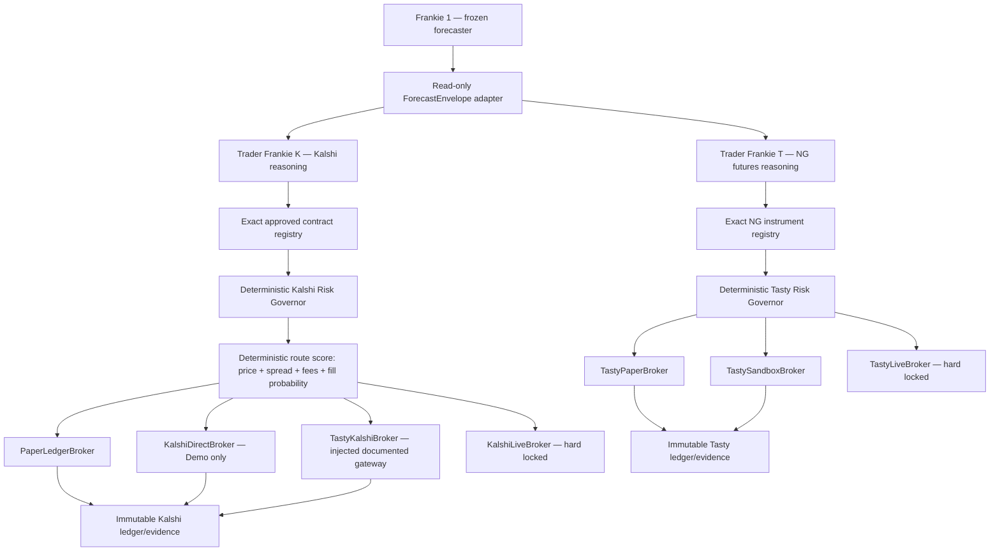

# Dual-venue Trader Frankie chassis

This package adds two isolated descendants while leaving Frankie 1 byte-identical:

## Boundaries

- Frankie 1 is protected by `freeze_manifest.json` and the freeze CI workflow.
- `ReadOnlyForecastAdapter` deep-copies JSON and fills unavailable semantic fields with `null`/empty
  tuples; it does not force Frankie 1 to emit anything new.
- Each trader has a separate identity, prompt, intent, registry, risk config, ledger, evidence,
  outcomes, proposals, and broker family.
- Trader outputs are proposals with `execution_authority=false`. Brokers accept only a runtime
  `ApprovedOrder` capability issued by the matching deterministic Risk Governor.
- Every UNKNOWN or MISMATCH identity stands down before risk. Only EXACT proceeds.
- All risk thresholds are mandatory explicit configuration. The example deliberately uses `null`
  and keeps the global kill switches on.
- SQLite ledger rows cannot be updated or deleted; corrections are new rows.
- Forecast and trader scorecards are separate. Learning is review-only via `LearningProposal` and
  never applies automatically across Frankie 1, Kalshi, or Tasty.

## Kalshi execution

The direct demo adapter uses the current V2 event order endpoint
`POST /portfolio/events/orders`. The approved payload carries `client_order_id`, the YES-book
`bid`/`ask` side, fixed-point dollar `price`, fixed-point `count`, and supported time-in-force.
Demo is pinned to `https://external-api.demo.kalshi.co/trade-api/v2`; production cannot be selected.
The signer is injected so RSA-PSS private-key material never enters the trader or repository.

The second event-contract route is present as `TastyKalshiBroker`. tastytrade publicly offers event
contracts, but its public developer API does not currently document their order endpoints. This
adapter therefore requires an injected supported gateway and fails closed when absent.

Official references:

- https://docs.kalshi.com/api-reference/orders/create-order-v2
- https://docs.kalshi.com/getting_started/api_environments
- https://docs.kalshi.com/getting_started/quick_start_websockets

## tastytrade execution

The instrument abstraction supports both `Future` and `Future Option`; v1 risk configuration enables
only the exact reviewed NG future. Paper snapshots should come from current live market data.
Sandbox is used only to validate authentication, margin/order dry-run, submit, cancel/replace,
fills, reconciliation, and restart behavior because tastytrade documents 15-minute-delayed sandbox
quotes and a 24-hour reset of trades, transactions, positions, and balances.

The sandbox adapter is pinned to `https://api.cert.tastyworks.com` and the current orders
`Accept-Version` header. Production cannot be selected.

Official references:

- https://developer.tastytrade.com/sandbox/
- https://developer.tastytrade.com/open-api-spec/instruments/
- https://developer.tastytrade.com/open-api-spec/orders/
- https://developer.tastytrade.com/open-api-spec/margin-requirements/

## Activation order

1. Populate and review an exact Kalshi mapping plus explicit paper risk/fill thresholds.
2. Wire a structured reasoning backend outside Trader Frankie K, run paper, and inspect stand-downs,
   fills, positions, settlements, P&L, and diagnosis in the immutable ledger.
3. Keep the same intent/risk/executor boundary and replace only paper with direct Kalshi Demo.
4. Populate the active `/NG` instrument mapping, run Tasty paper on live quotes, then replace only
   the broker with tastytrade Sandbox for API lifecycle validation.
5. Live execution remains a later code promotion and separate review; no v1 configuration enables it.
